# Forge Loom — PostgreSQL/Prisma Database Design

Supersedes the archived Firebase/Firestore direction (`docs/archive/`). Forge Loom stays on a **PERN** stack: Postgres replaces MongoDB, Prisma replaces Mongoose. Nothing else architecturally changes — Express, the existing custom JWT+Redis auth, BullMQ+Redis background jobs, and MinIO/S3 file storage are untouched (verified: `apps/server/src/config/env.ts`'s JWT/Redis/S3 vars are already independent of `MONGO_URI`). Companion doc: `docs/prisma-migration-tickets.md` for the implementation ticket breakdown.

Grounded in the actual 34 current Mongoose models and their service-layer code (`apps/server/src/models/*.ts`, `apps/server/src/modules/**`), verified live on 2026-09-01 — not just the higher-level architecture doc, which had already drifted from what got built across 10 phases.

---

## 0. Framing decisions (apply throughout)

**0.1 Primary key strategy: `String @id @default(cuid())`, not native `uuid` and not `Int` autoincrement.**
Mongo ObjectIds are 24-char hex opaque strings threaded through URLs, JWTs, DTOs, and route params everywhere in `apps/server/src/modules/**`. Two alternatives were rejected:
- **Autoincrement `Int`** — would touch every route param, every DTO type, every `.mapper.ts` `id: x._id.toString()` call, and would leak sequential/guessable IDs into public URLs. Not worth it for a persistence-layer-only migration.
- **Native Postgres `uuid` column type** — enforces RFC-4122 format. Mongo ObjectIds are **not** valid UUIDs, so a native `uuid` column would make it impossible to carry forward existing Mongo `_id` values as-is; every FK across all 34 collections would need an id-remapping table — exactly the pain the cancelled Firebase-uid plan had, avoided here.

`String @id @default(cuid())` uses a plain `TEXT`/`VARCHAR` column with no format constraint. New rows get a 25-char base36 cuid; **migrated rows get the literal old Mongo ObjectId string written into the same column** — no remapping table, no dual-write period, no id-translation layer anywhere in the app. This is the single most important simplification versus the cancelled Firebase plan.

**0.2 Three categories of Mongo arrays — only one needs a normalized child table.**

| Pattern | Example | Postgres treatment |
|---|---|---|
| Scalar value list (no object shape, no FK semantics) | `skills[]`, `tags[]`, `agenda[]`, `artifactUrls[]`, `expertise[]`, `topics[]`, `interests[]`, `streakHistory[bool]` | Native Postgres array column via Prisma scalar lists: `String[]` / `Boolean[]`. **No new table.** |
| Array of foreign-key references (relation, not data) | `Team.memberStudentIds[]`, `CommunityLeaderProfile.volunteerNetwork[]`, `MentorProfile.assignedStudents[]`, `TrainerProfile.assignedTeams[]` | Real join table (many-to-many) **or** a derived reverse relation if the array is provably redundant with an existing singular FK (see 0.3). |
| Array of embedded sub-documents (has its own fields) | `Course.syllabus[]`, `Sprint.tasks[]`, `ProblemStatement.deliverables[]`, `MilestoneSubmission.mentorFeedback[]`, `CommunityLeaderProfile.members[]` | Normalized child table with its own PK + FK back to parent (per the locked-in decision to normalize, not use JSONB). |

**0.3 Two of the four FK-reference arrays are redundant and get collapsed, not joined.** Verified against the actual service code, not just the model files:
- `TrainerProfile.assignedTeams[]` is written in lockstep with `Team.trainerId` (`team.service.ts:74,130,135` does `$addToSet`/`$pull` on it every time `Team.trainerId` changes) and is **only ever read** as `.length` in `college.service.ts:115`. It is 100% derivable from `Team.trainerId`. **Dropped as a stored field.** `college.service.ts:115` (`t.assignedTeams.length`) becomes `prisma.team.count({ where: { trainerId: t.userId } })`.
- `MentorProfile.assignedStudents[]` is **never written anywhere in the codebase** (grepped — zero writes, only the same `.length` read in `college.service.ts:121`). It is redundant with `StudentProfile.mentorId → MentorProfile`. **Dropped as a stored field.** `college.service.ts:121` becomes `prisma.studentProfile.count({ where: { mentorId: m.id } })`.

The other two — `Team.memberStudentIds[]` and `CommunityLeaderProfile.volunteerNetwork[]` — have **no** corresponding singular FK anywhere else pointing back, so they get real join tables (`TeamMember`, `CommunityVolunteer`).

**0.4 Money fields move from `Number`/float to `Decimal`.** `Course.price` and `Enrollment.paymentAmount` become `Decimal @db.Decimal(10,2)`. A genuine correctness improvement, but **not free in application code**: Prisma returns `Decimal` fields as a `Decimal.js`-style object, not a plain `number`. `course.mapper.ts`, `course.service.ts`, `enrollment.mapper.ts`, and `enrollment.service.ts` (all four confirmed via grep to touch `price`/`paymentAmount`) need `.toNumber()` at the DTO boundary and wherever the value reaches the Razorpay SDK (which wants a plain JS number/paise integer).

**0.5 Ordering columns added where Mongo's array position was implicit.** `SyllabusDay.dayNumber` and `MilestoneFeedback.createdAt` already give a natural sort order after normalization. `SprintTask` and `ProblemStatementDeliverable` do **not** — a Postgres child table has no guaranteed row order without an `ORDER BY`. Both get an explicit `order Int` column, populated from array index during the data migration; every service read of these two lists must add `orderBy: { order: 'asc' }`.

---

## 1. Prisma schema

Table/model naming: kept **identical to the existing Mongoose model names** (no `@@map`/`@map` snake_casing) — Prisma auto-quotes identifiers for Postgres regardless of case, no other tool touches this database with raw SQL that assumes snake_case, and 1:1 naming minimizes the mental diff for the migration and its review.

```prisma
// apps/server/prisma/schema.prisma
generator client {
  provider = "prisma-client-js"
}

datasource db {
  provider = "postgresql"
  url      = env("DATABASE_URL")
}

// ─────────────────────────────────────────────────────────────────────────
// ENUMS (one per Mongoose `enum:` field, values verbatim)
// ─────────────────────────────────────────────────────────────────────────

enum Role {
  student
  mentor
  trainer
  speaker
  hr
  sponsor
  college_admin
  community_leader
  media_partner
  member
  forge_admin
  course_admin
}

enum UserStatus {
  active
  pending_verification
  suspended
}

enum CommunityMemberRole {
  lead
  volunteer
  public
}

enum CollegePartnerTier {
  bronze
  silver
  gold
}

enum CourseDeliveryMode {
  online
  offline
}

enum CourseStatus {
  draft
  published
  archived
}

enum CourseSessionMode {
  offline
  live_online
  self_paced
}

enum CourseSessionStatus {
  scheduled
  completed
  cancelled
}

enum EnrollmentStatus {
  pending_payment
  active
  completed
  refunded
}

enum AttendanceStatus {
  present
  absent
  excused
}

enum AssessmentType {
  quiz
  exam
  assignment
}

enum CohortPhase {
  activation
  bootcamp
  citadel
}

enum ProblemStatementSource {
  industry
  government
  internal
}

enum ProblemStatementDifficulty {
  easy
  medium
  hard
}

enum ProblemStatementStatus {
  open
  closed
}

enum SprintStatus {
  not_started
  in_progress
  submitted
  reviewed
  complete
}

enum SprintTaskStatus {
  pending
  in_progress
  completed
}

enum BookingStatus {
  upcoming
  completed
  cancelled
}

enum NotificationType {
  booking_created
  booking_cancelled
  milestone_reviewed
  investor_access_granted
  session_cancelled
  certificate_issued
}

enum EventType {
  hackathon
  seminar
  workshop
  other
}

enum AccessRequestStatus {
  pending
  approved
  denied
}

enum SpeakerTopicStatus {
  proposed
  booked
}

enum ScoreCategory {
  events
  project
  mentor
  team
}

enum PlacementStatus {
  applied
  interviewing
  offered
  placed
}

// ─────────────────────────────────────────────────────────────────────────
// IDENTITY / PROFILES
// ─────────────────────────────────────────────────────────────────────────

model User {
  id                   String     @id @default(cuid())
  email                String     @unique
  passwordHash         String
  role                 Role
  status               UserStatus @default(active)
  collegeId            String?
  college              College?   @relation(fields: [collegeId], references: [id], onDelete: Restrict, onUpdate: Cascade)
  mfaEnabled           Boolean    @default(false)
  refreshTokenVersion  Int        @default(0)
  lastLoginAt          DateTime?
  createdAt            DateTime   @default(now())
  updatedAt            DateTime   @updatedAt

  // 1-1 role profiles (Cascade: profile has no purpose without the account)
  studentProfile          StudentProfile?
  mentorProfile           MentorProfile?
  trainerProfile          TrainerProfile?
  speakerProfile          SpeakerProfile?
  hrProfile               HrProfile?
  sponsorProfile          SponsorProfile?
  collegeProfile          CollegeProfile?
  communityLeaderProfile  CommunityLeaderProfile?
  mediaPartnerProfile     MediaPartnerProfile?
  memberProfile           MemberProfile?
  courseAdminProfile      CourseAdminProfile?

  // Reverse relations used as "actor" across the app (Restrict — see §2)
  markedAttendance        AttendanceRecord[]      @relation("AttendanceMarkedBy")
  attendanceAsStudent     AttendanceRecord[]      @relation("AttendanceStudent")
  enrollments             Enrollment[]
  videoProgress           VideoProgress[]
  certificates            Certificate[]
  scoreEvents             ScoreEvent[]
  bookingsRequested       Booking[]               @relation("BookingRequester")
  bookingsAsMentor        Booking[]               @relation("BookingMentor")
  notifications           Notification[]
  communityPosts          CommunityPost[]
  eventsHosted            Event[]                 @relation("EventHost")
  eventRegistrations      EventRegistration[]
  accessRequestsMade      AccessRequest[]
  speakerTopics           SpeakerTopic[]
  bookmarks               Bookmark[]
  interestExpressions     InterestExpression[]
  placements              Placement[]
  teamMemberships         TeamMember[]
  communityMemberOf       CommunityMember[]
  communityVolunteerOf    CommunityVolunteer[]
  postedProblemStatements ProblemStatement[]      @relation("ProblemStatementPostedBy")
  milestoneFeedbackGiven  MilestoneFeedback[]

  // Soft/nullable "assigned to" relations (SetNull — see §2)
  coursesAsTrainer        Course[]                @relation("CourseTrainer")
  sessionsAsTrainer       CourseSession[]         @relation("CourseSessionTrainer")
  teamsAsMentor           Team[]                  @relation("TeamMentor")
  teamsAsTrainer          Team[]                  @relation("TeamTrainer")

  @@index([role])
}

model StudentProfile {
  id             String   @id @default(cuid())
  userId         String   @unique
  user           User     @relation(fields: [userId], references: [id], onDelete: Cascade, onUpdate: Cascade)
  collegeId      String?
  college        College? @relation(fields: [collegeId], references: [id], onDelete: Restrict, onUpdate: Cascade)
  name           String
  course         String?
  mentorId       String?
  mentor         MentorProfile? @relation(fields: [mentorId], references: [id], onDelete: SetNull, onUpdate: Cascade)
  builderScore   Int      @default(0)
  skills         String[] @default([])
  domain         String?
  linkedIn       String?
  // Gamification — cosmetic only, does not feed builderScore.
  currentStreak  Int      @default(0)
  xp             Int      @default(0)
  streakHistory  Boolean[] @default([])
  createdAt      DateTime @default(now())
  updatedAt      DateTime @updatedAt

  teamMemberships TeamMember[]

  // Talent Pool scoping/filter — mirrors Mongo compound index {collegeId,domain,builderScore desc}
  @@index([collegeId, domain, builderScore(sort: Desc)])
}

model MentorProfile {
  id         String   @id @default(cuid())
  userId     String   @unique
  user       User     @relation(fields: [userId], references: [id], onDelete: Cascade, onUpdate: Cascade)
  collegeId  String?
  college    College? @relation(fields: [collegeId], references: [id], onDelete: Restrict, onUpdate: Cascade)
  expertise  String[] @default([])
  bio        String?
  createdAt  DateTime @default(now())
  updatedAt  DateTime @updatedAt

  // Derived — replaces Mongo's stored `assignedStudents[]` (see §0.3)
  students   StudentProfile[]

  @@index([collegeId])
}

model TrainerProfile {
  id         String   @id @default(cuid())
  userId     String   @unique
  user       User     @relation(fields: [userId], references: [id], onDelete: Cascade, onUpdate: Cascade)
  collegeId  String?
  college    College? @relation(fields: [collegeId], references: [id], onDelete: Restrict, onUpdate: Cascade)
  expertise  String[] @default([])
  createdAt  DateTime @default(now())
  updatedAt  DateTime @updatedAt

  // NOTE: `assignedTeams[]` deliberately dropped — derive via
  // `User.teamsAsTrainer` using this profile's `userId` (see §0.3).

  @@index([collegeId])
}

model SpeakerProfile {
  id            String   @id @default(cuid())
  userId        String   @unique
  user          User     @relation(fields: [userId], references: [id], onDelete: Cascade, onUpdate: Cascade)
  topics        String[] @default([])
  bio           String?
  createdAt     DateTime @default(now())
  updatedAt     DateTime @updatedAt

  pastSessions  SpeakerPastSession[]
}

// Dormant join table (schema completeness — `pastSessions` is never read or
// written anywhere in the current codebase, same status as `Placement`).
model SpeakerPastSession {
  speakerProfileId String
  speakerProfile   SpeakerProfile @relation(fields: [speakerProfileId], references: [id], onDelete: Cascade, onUpdate: Cascade)
  bookingId        String
  booking          Booking        @relation(fields: [bookingId], references: [id], onDelete: Cascade, onUpdate: Cascade)

  @@id([speakerProfileId, bookingId])
}

model HrProfile {
  id             String   @id @default(cuid())
  userId         String   @unique
  user           User     @relation(fields: [userId], references: [id], onDelete: Cascade, onUpdate: Cascade)
  companyName    String
  industry       String?
  companyDetails String?
  createdAt      DateTime @default(now())
  updatedAt      DateTime @updatedAt

  placements     Placement[]
}

model SponsorProfile {
  id              String   @id @default(cuid())
  userId          String   @unique
  user            User     @relation(fields: [userId], references: [id], onDelete: Cascade, onUpdate: Cascade)
  orgName         String
  sponsorshipTier String?
  createdAt       DateTime @default(now())
  updatedAt       DateTime @updatedAt
}

model CollegeProfile {
  id                String   @id @default(cuid())
  userId            String   @unique
  user              User     @relation(fields: [userId], references: [id], onDelete: Cascade, onUpdate: Cascade)
  collegeId         String
  college           College  @relation(fields: [collegeId], references: [id], onDelete: Restrict, onUpdate: Cascade)
  collegeName       String
  accreditationInfo String?
  createdAt         DateTime @default(now())
  updatedAt         DateTime @updatedAt
}

model CommunityLeaderProfile {
  id         String   @id @default(cuid())
  userId     String   @unique
  user       User     @relation(fields: [userId], references: [id], onDelete: Cascade, onUpdate: Cascade)
  orgName    String
  createdAt  DateTime @default(now())
  updatedAt  DateTime @updatedAt

  members    CommunityMember[]
  volunteers CommunityVolunteer[]
}

// Normalizes CommunityLeaderProfile.members[] (embedded subdocs).
// Upsert-by-userId semantics from communityMember.service.ts map directly
// onto the compound PK below.
model CommunityMember {
  communityLeaderProfileId String
  communityLeaderProfile   CommunityLeaderProfile @relation(fields: [communityLeaderProfileId], references: [id], onDelete: Cascade, onUpdate: Cascade)
  userId                   String
  user                     User                   @relation(fields: [userId], references: [id], onDelete: Restrict, onUpdate: Cascade)
  role                     CommunityMemberRole    @default(public)
  createdAt                DateTime               @default(now())

  @@id([communityLeaderProfileId, userId])
}

// Normalizes CommunityLeaderProfile.volunteerNetwork[] (many-to-many,
// dormant — never read/written in the current codebase; modeled for
// schema completeness, same status as Placement).
model CommunityVolunteer {
  communityLeaderProfileId String
  communityLeaderProfile   CommunityLeaderProfile @relation(fields: [communityLeaderProfileId], references: [id], onDelete: Cascade, onUpdate: Cascade)
  userId                   String
  user                     User                   @relation(fields: [userId], references: [id], onDelete: Restrict, onUpdate: Cascade)

  @@id([communityLeaderProfileId, userId])
}

model MediaPartnerProfile {
  id          String   @id @default(cuid())
  userId      String   @unique
  user        User     @relation(fields: [userId], references: [id], onDelete: Cascade, onUpdate: Cascade)
  outlet      String
  accessLevel String?
  createdAt   DateTime @default(now())
  updatedAt   DateTime @updatedAt
}

model MemberProfile {
  id        String   @id @default(cuid())
  userId    String   @unique
  user      User     @relation(fields: [userId], references: [id], onDelete: Cascade, onUpdate: Cascade)
  interests String[] @default([])
  createdAt DateTime @default(now())
  updatedAt DateTime @updatedAt
}

model CourseAdminProfile {
  id         String   @id @default(cuid())
  userId     String   @unique
  user       User     @relation(fields: [userId], references: [id], onDelete: Cascade, onUpdate: Cascade)
  name       String
  department String?
  createdAt  DateTime @default(now())
  updatedAt  DateTime @updatedAt

  coursesCreated Course[]
}

// ─────────────────────────────────────────────────────────────────────────
// COURSES / ENROLLMENT / SESSIONS
// ─────────────────────────────────────────────────────────────────────────

model College {
  id          String             @id @default(cuid())
  name        String
  location    String?
  partnerTier CollegePartnerTier @default(bronze)
  createdAt   DateTime           @default(now())
  updatedAt   DateTime           @updatedAt

  users            User[]
  studentProfiles  StudentProfile[]
  mentorProfiles   MentorProfile[]
  trainerProfiles  TrainerProfile[]
  collegeProfiles  CollegeProfile[]
  cohorts          Cohort[]
  teams            Team[]
  events           Event[]
}

model Course {
  id           String             @id @default(cuid())
  title        String
  description  String?
  createdBy    String
  courseAdmin  CourseAdminProfile @relation(fields: [createdBy], references: [id], onDelete: Restrict, onUpdate: Cascade)
  deliveryMode CourseDeliveryMode
  durationHours Int
  durationDays  Int
  price        Decimal            @db.Decimal(10, 2)
  currency     String             @default("INR")
  status       CourseStatus       @default(draft)
  trainerId    String?
  trainer      User?              @relation("CourseTrainer", fields: [trainerId], references: [id], onDelete: SetNull, onUpdate: Cascade)
  createdAt    DateTime           @default(now())
  updatedAt    DateTime           @updatedAt

  syllabus     SyllabusDay[]
  sessions     CourseSession[]
  enrollments  Enrollment[]
  assessments  Assessment[]
  videoProgress VideoProgress[]
  certificates Certificate[]

  @@index([createdBy])
  @@index([trainerId])
  @@index([status, createdAt(sort: Desc)])
}

// Normalizes Course.syllabus[] (embedded subdocs).
model SyllabusDay {
  id              String  @id @default(cuid())
  courseId        String
  course          Course  @relation(fields: [courseId], references: [id], onDelete: Cascade, onUpdate: Cascade)
  dayNumber       Int
  title           String
  description     String?
  youtubeVideoId  String?

  @@unique([courseId, dayNumber])
}

model CourseSession {
  id            String               @id @default(cuid())
  courseId      String
  course        Course               @relation(fields: [courseId], references: [id], onDelete: Restrict, onUpdate: Cascade)
  dayNumber     Int
  scheduledDate DateTime
  mode          CourseSessionMode
  status        CourseSessionStatus  @default(scheduled)
  cancelReason  String?
  trainerId     String?
  trainer       User?                @relation("CourseSessionTrainer", fields: [trainerId], references: [id], onDelete: SetNull, onUpdate: Cascade)
  createdAt     DateTime             @default(now())
  updatedAt     DateTime             @updatedAt

  attendanceRecords AttendanceRecord[]

  @@unique([courseId, dayNumber])
}

model Enrollment {
  id              String            @id @default(cuid())
  studentId       String
  student         User              @relation(fields: [studentId], references: [id], onDelete: Restrict, onUpdate: Cascade)
  courseId        String
  course          Course            @relation(fields: [courseId], references: [id], onDelete: Restrict, onUpdate: Cascade)
  status          EnrollmentStatus  @default(pending_payment)
  razorpayOrderId String?
  paymentRef      String?
  paymentAmount   Decimal           @db.Decimal(10, 2)
  enrolledAt      DateTime          @default(now())
  completedAt     DateTime?
  createdAt       DateTime          @default(now())
  updatedAt       DateTime          @updatedAt

  certificate     Certificate?

  @@index([courseId])
  @@index([studentId, createdAt(sort: Desc)])
}

model AttendanceRecord {
  id        String            @id @default(cuid())
  sessionId String
  session   CourseSession     @relation(fields: [sessionId], references: [id], onDelete: Restrict, onUpdate: Cascade)
  studentId String
  student   User              @relation("AttendanceStudent", fields: [studentId], references: [id], onDelete: Restrict, onUpdate: Cascade)
  status    AttendanceStatus
  markedAt  DateTime          @default(now())
  markedBy  String
  marker    User              @relation("AttendanceMarkedBy", fields: [markedBy], references: [id], onDelete: Restrict, onUpdate: Cascade)
  createdAt DateTime          @default(now())
  updatedAt DateTime          @updatedAt

  @@unique([sessionId, studentId])
  @@index([studentId, markedAt(sort: Desc)])
}

model VideoProgress {
  id                  String   @id @default(cuid())
  studentId           String
  student             User     @relation(fields: [studentId], references: [id], onDelete: Restrict, onUpdate: Cascade)
  courseId            String
  course              Course   @relation(fields: [courseId], references: [id], onDelete: Restrict, onUpdate: Cascade)
  dayNumber           Int
  lastPositionSeconds Int
  durationSeconds     Int
  percentWatched      Int
  completed           Boolean  @default(false)
  createdAt           DateTime @default(now())
  updatedAt           DateTime @updatedAt

  @@unique([studentId, courseId, dayNumber])
}

model Assessment {
  id            String         @id @default(cuid())
  courseId      String
  course        Course         @relation(fields: [courseId], references: [id], onDelete: Restrict, onUpdate: Cascade)
  title         String
  type          AssessmentType
  scheduledDate DateTime
  createdAt     DateTime       @default(now())
  updatedAt     DateTime       @updatedAt

  @@index([courseId])
}

model Certificate {
  id            String     @id @default(cuid())
  studentId     String
  student       User       @relation(fields: [studentId], references: [id], onDelete: Restrict, onUpdate: Cascade)
  courseId      String
  course        Course     @relation(fields: [courseId], references: [id], onDelete: Restrict, onUpdate: Cascade)
  enrollmentId  String     @unique
  enrollment    Enrollment @relation(fields: [enrollmentId], references: [id], onDelete: Restrict, onUpdate: Cascade)
  courseTitle   String
  issuingBody   String
  token         String     @unique
  pdfKey        String
  issuedAt      DateTime   @default(now())
  createdAt     DateTime   @default(now())
  updatedAt     DateTime   @updatedAt

  @@index([studentId])
}

// ─────────────────────────────────────────────────────────────────────────
// CITADEL
// ─────────────────────────────────────────────────────────────────────────

model Cohort {
  id        String      @id @default(cuid())
  collegeId String
  college   College     @relation(fields: [collegeId], references: [id], onDelete: Restrict, onUpdate: Cascade)
  name      String
  startDate DateTime
  endDate   DateTime
  phase     CohortPhase @default(activation)
  createdAt DateTime    @default(now())
  updatedAt DateTime    @updatedAt

  @@index([collegeId])
}

model Team {
  id                 String   @id @default(cuid())
  name               String
  collegeId          String
  college            College  @relation(fields: [collegeId], references: [id], onDelete: Restrict, onUpdate: Cascade)
  mentorId           String?
  mentor             User?    @relation("TeamMentor", fields: [mentorId], references: [id], onDelete: SetNull, onUpdate: Cascade)
  trainerId          String?
  trainer            User?    @relation("TeamTrainer", fields: [trainerId], references: [id], onDelete: SetNull, onUpdate: Cascade)
  // Real FK now — Mongo declared no `ref` here despite conceptually pointing
  // at ProblemStatement (a pre-existing inconsistency this migration fixes).
  problemStatementId String?
  problemStatement   ProblemStatement? @relation(fields: [problemStatementId], references: [id], onDelete: SetNull, onUpdate: Cascade)
  createdAt          DateTime @default(now())
  updatedAt          DateTime @updatedAt

  members            TeamMember[]
  sprints            Sprint[]
  milestoneSubmissions MilestoneSubmission[]
  investorAccessGrant  InvestorAccessGrant?

  @@index([collegeId])
}

// Normalizes Team.memberStudentIds[] (many-to-many, no derivable singular
// FK on the other side — genuine join table, unlike assignedStudents/Teams).
model TeamMember {
  teamId        String
  team          Team           @relation(fields: [teamId], references: [id], onDelete: Cascade, onUpdate: Cascade)
  studentUserId String
  student       User           @relation(fields: [studentUserId], references: [id], onDelete: Restrict, onUpdate: Cascade)
  studentProfileId String?
  studentProfile   StudentProfile? @relation(fields: [studentProfileId], references: [id], onDelete: SetNull, onUpdate: Cascade)
  createdAt     DateTime       @default(now())

  @@id([teamId, studentUserId])
}

model ProblemStatement {
  id             String                     @id @default(cuid())
  title          String
  description    String
  overview       String?
  source         ProblemStatementSource
  domain         String
  tags           String[]                   @default([])
  teamSize       Int
  durationWeeks  Int
  difficulty     ProblemStatementDifficulty
  status         ProblemStatementStatus     @default(open)
  featured       Boolean                    @default(false)
  postedBy       String?
  postedByUser   User?                      @relation("ProblemStatementPostedBy", fields: [postedBy], references: [id], onDelete: SetNull, onUpdate: Cascade)
  createdAt      DateTime                   @default(now())
  updatedAt      DateTime                   @updatedAt

  deliverables        ProblemStatementDeliverable[]
  teams               Team[]
  bookmarks           Bookmark[]
  interestExpressions InterestExpression[]

  @@index([status])
}

// Normalizes ProblemStatement.deliverables[] (embedded subdocs). No natural
// order column existed in Mongo — `order` is added and populated from array
// index at migration time (see §0.5).
model ProblemStatementDeliverable {
  id                 String           @id @default(cuid())
  problemStatementId String
  problemStatement   ProblemStatement @relation(fields: [problemStatementId], references: [id], onDelete: Cascade, onUpdate: Cascade)
  title              String
  done               Boolean          @default(false)
  order              Int
}

model Sprint {
  id              String       @id @default(cuid())
  teamId          String
  team            Team         @relation(fields: [teamId], references: [id], onDelete: Cascade, onUpdate: Cascade)
  cycleNumber     Int
  status          SprintStatus @default(not_started)
  startDate       DateTime
  endDate         DateTime
  progressPercent Int          @default(0)
  createdAt       DateTime     @default(now())
  updatedAt       DateTime     @updatedAt

  tasks               SprintTask[]
  milestoneSubmissions MilestoneSubmission[]

  @@unique([teamId, cycleNumber])
}

// Normalizes Sprint.tasks[] (embedded subdocs). `order` added (see §0.5).
model SprintTask {
  id       String           @id @default(cuid())
  sprintId String
  sprint   Sprint           @relation(fields: [sprintId], references: [id], onDelete: Cascade, onUpdate: Cascade)
  title    String
  status   SprintTaskStatus @default(pending)
  dueDate  DateTime
  order    Int
}

model MilestoneSubmission {
  id           String    @id @default(cuid())
  sprintId     String
  sprint       Sprint    @relation(fields: [sprintId], references: [id], onDelete: Cascade, onUpdate: Cascade)
  teamId       String
  team         Team      @relation(fields: [teamId], references: [id], onDelete: Cascade, onUpdate: Cascade)
  artifactUrls String[]  @default([])
  demoDate     DateTime?
  createdAt    DateTime  @default(now())
  updatedAt    DateTime  @updatedAt

  mentorFeedback MilestoneFeedback[]

  @@index([sprintId, createdAt(sort: Desc)])
}

// Normalizes MilestoneSubmission.mentorFeedback[] (embedded subdocs,
// append-only — ordered naturally by createdAt, no extra `order` needed).
model MilestoneFeedback {
  id                    String              @id @default(cuid())
  milestoneSubmissionId String
  milestoneSubmission   MilestoneSubmission @relation(fields: [milestoneSubmissionId], references: [id], onDelete: Cascade, onUpdate: Cascade)
  mentorId              String
  mentor                User                @relation(fields: [mentorId], references: [id], onDelete: Restrict, onUpdate: Cascade)
  comment               String
  rating                Int?                @db.SmallInt // 1-5, enforced in the service layer via zod (see Assumption A below)
  createdAt             DateTime            @default(now())
}

model InvestorAccessGrant {
  id        String   @id @default(cuid())
  teamId    String   @unique
  team      Team     @relation(fields: [teamId], references: [id], onDelete: Cascade, onUpdate: Cascade)
  grantedAt DateTime @default(now())
  reason    String
  createdAt DateTime @default(now())
  updatedAt DateTime @updatedAt
}

// Append-only, no updatedAt (matches Mongo `{timestamps:false}` list).
model Bookmark {
  userId             String
  user               User             @relation(fields: [userId], references: [id], onDelete: Restrict, onUpdate: Cascade)
  problemStatementId String
  problemStatement   ProblemStatement @relation(fields: [problemStatementId], references: [id], onDelete: Cascade, onUpdate: Cascade)
  createdAt          DateTime         @default(now())

  @@id([userId, problemStatementId])
}

model InterestExpression {
  userId             String
  user               User             @relation(fields: [userId], references: [id], onDelete: Restrict, onUpdate: Cascade)
  problemStatementId String
  problemStatement   ProblemStatement @relation(fields: [problemStatementId], references: [id], onDelete: Cascade, onUpdate: Cascade)
  createdAt          DateTime         @default(now())

  @@id([userId, problemStatementId])
}

// ─────────────────────────────────────────────────────────────────────────
// SCORING
// ─────────────────────────────────────────────────────────────────────────

// Append-only, no updatedAt. No HTTP route — written by sprint.service.ts
// and the BullMQ score-recompute worker only.
model ScoreEvent {
  id        String        @id @default(cuid())
  studentId String
  student   User          @relation(fields: [studentId], references: [id], onDelete: Restrict, onUpdate: Cascade)
  category  ScoreCategory
  points    Int
  reason    String
  sourceRef String?
  createdAt DateTime      @default(now())

  @@index([studentId, category])
}

// ─────────────────────────────────────────────────────────────────────────
// ENGAGEMENT
// ─────────────────────────────────────────────────────────────────────────

model Booking {
  id              String        @id @default(cuid())
  requesterId     String
  requester       User          @relation("BookingRequester", fields: [requesterId], references: [id], onDelete: Restrict, onUpdate: Cascade)
  // Field name kept as `mentorId` for historical reasons though it now means
  // "the other party" for any role pairing — renaming is out of scope for a
  // persistence-layer-only migration.
  mentorId        String
  mentor          User          @relation("BookingMentor", fields: [mentorId], references: [id], onDelete: Restrict, onUpdate: Cascade)
  title           String
  scheduledAt     DateTime
  durationMinutes Int           @default(30)
  mode            String        @default("Google Meet")
  status          BookingStatus @default(upcoming)
  agenda          String[]      @default([])
  note            String?
  meetingLink     String?
  createdAt       DateTime      @default(now())
  updatedAt       DateTime      @updatedAt

  speakerPastSessionOf SpeakerPastSession[]

  @@index([requesterId, scheduledAt(sort: Desc)])
  @@index([mentorId, scheduledAt(sort: Desc)])
}

// No updatedAt.
model Notification {
  id        String           @id @default(cuid())
  userId    String
  user      User             @relation(fields: [userId], references: [id], onDelete: Restrict, onUpdate: Cascade)
  type      NotificationType
  title     String
  body      String?
  read      Boolean          @default(false)
  createdAt DateTime         @default(now())

  @@index([userId, createdAt(sort: Desc)])
}

// No updatedAt.
model CommunityPost {
  id        String   @id @default(cuid())
  authorId  String
  author    User     @relation(fields: [authorId], references: [id], onDelete: Restrict, onUpdate: Cascade)
  content   String
  createdAt DateTime @default(now())

  @@index([createdAt(sort: Desc)])
}

model Event {
  id          String    @id @default(cuid())
  title       String
  description String?
  type        EventType
  hostedBy    String
  host        User      @relation("EventHost", fields: [hostedBy], references: [id], onDelete: Restrict, onUpdate: Cascade)
  collegeId   String?
  college     College?  @relation(fields: [collegeId], references: [id], onDelete: SetNull, onUpdate: Cascade)
  venue       String?
  scheduledAt DateTime
  agenda      String[]  @default([])
  featured    Boolean   @default(false)
  createdAt   DateTime  @default(now())
  updatedAt   DateTime  @updatedAt

  registrations   EventRegistration[]
  accessRequests  AccessRequest[]

  @@index([scheduledAt])
}

// No updatedAt.
model EventRegistration {
  eventId      String
  event        Event    @relation(fields: [eventId], references: [id], onDelete: Cascade, onUpdate: Cascade)
  userId       String
  user         User     @relation(fields: [userId], references: [id], onDelete: Restrict, onUpdate: Cascade)
  registeredAt DateTime @default(now())

  @@id([eventId, userId])
}

// Surrogate `id` kept (unlike Bookmark/InterestExpression/EventRegistration)
// because accessRequest.service.ts looks these up via findById(requestId).
// No updatedAt.
model AccessRequest {
  id          String               @id @default(cuid())
  requesterId String
  requester   User                 @relation(fields: [requesterId], references: [id], onDelete: Restrict, onUpdate: Cascade)
  eventId     String
  event       Event                @relation(fields: [eventId], references: [id], onDelete: Cascade, onUpdate: Cascade)
  status      AccessRequestStatus  @default(pending)
  requestedAt DateTime             @default(now())
  decidedAt   DateTime?

  @@unique([requesterId, eventId])
}

model SpeakerTopic {
  id          String              @id @default(cuid())
  speakerId   String
  speaker     User                @relation(fields: [speakerId], references: [id], onDelete: Restrict, onUpdate: Cascade)
  title       String
  description String?
  status      SpeakerTopicStatus  @default(proposed)
  scheduledAt DateTime?
  venue       String?
  createdAt   DateTime            @default(now())
  updatedAt   DateTime            @updatedAt

  @@index([speakerId])
}

// ─────────────────────────────────────────────────────────────────────────
// ADMIN / DORMANT
// ─────────────────────────────────────────────────────────────────────────

// Registered-but-fully-dormant — zero controllers/routes/services reference
// this today. Table exists for schema completeness only; the data migration
// script gets an empty no-op step for it (no source data exists).
model Placement {
  id        String          @id @default(cuid())
  studentId String
  student   User            @relation(fields: [studentId], references: [id], onDelete: Restrict, onUpdate: Cascade)
  companyId String
  company   HrProfile       @relation(fields: [companyId], references: [id], onDelete: Cascade, onUpdate: Cascade)
  status    PlacementStatus @default(applied)
  role      String
  date      DateTime
  createdAt DateTime        @default(now())
  updatedAt DateTime        @updatedAt

  @@index([studentId])
}
```

**Assumption A (flagged, not re-derived elsewhere):** Prisma has no native `CHECK` constraint DSL in the stable schema syntax used here, so `MilestoneFeedback.rating`'s 1–5 bound (enforced today by Mongoose's `min/max`) is enforced only by the existing Zod validation in `sprint.service.ts`/mapper, same as today — not newly weakened, just not gaining a DB-level guarantee it didn't have before either (Mongoose's `min/max` is also just app-level validation, not a Mongo server-side constraint).

---

## 2. Relational integrity decisions (the `onDelete` policy, stated as one rule set)

Verified first: **the running application never hard-deletes `Course`, `Team`, `Enrollment`, `CourseSession`, `ProblemStatement`, or `Event` today** — grepped every module for delete-style calls; the only genuine hard-delete in the whole codebase is `problemStatement.service.ts:89`'s `existing.deleteOne()`, which deletes a `Bookmark` row (an un-toggle), not the `ProblemStatement` itself. So every `onDelete` choice below is a **defensive DB-level policy for tooling that doesn't exist yet** (admin panels, GDPR/user-deletion requests, manual DB ops) — Postgres is being asked to enforce discipline Mongo never had a way to enforce at all.

Three buckets, applied consistently:

1. **Cascade** — child row has zero independent meaning without the parent (a "detail," not a "record"). All 11 role-profile tables → `User`; all 5 normalized embedded-array child tables → their parent; all pure join tables → both parents; `Sprint`/`MilestoneSubmission`/`InvestorAccessGrant` → `Team`; `MilestoneFeedback` → `MilestoneSubmission`; `SyllabusDay` → `Course`; `Bookmark`/`InterestExpression`/`EventRegistration` → `ProblemStatement`/`Event`; `Placement` → `HrProfile`.
2. **Restrict** — either (a) the parent is an organizational-scoping entity (`College`) that must never silently cascade-wipe everything scoped to it, or (b) the FK points at `User` as a transactional "who did this" actor on a row with independent audit/financial/legal significance (`Enrollment`, `Certificate`, `AttendanceRecord`, `ScoreEvent`, `Booking`, `Notification`, `CommunityPost`, `Event.hostedBy`, `SpeakerTopic`, `EventRegistration`, `AccessRequest`, `Bookmark`, `InterestExpression`, `MilestoneFeedback.mentorId`, `Placement.studentId`, `TeamMember.studentUserId`, `CommunityMember`/`CommunityVolunteer.userId`), or (c) `Course` → its children (`CourseSession`, `Enrollment`, `Assessment`, `VideoProgress`, `Certificate`) and `CourseSession` → `AttendanceRecord`, protecting scheduling/financial/attendance history from disappearing if someone tries to delete a course instead of archiving it. Because the app has no user-hard-delete flow today, Restrict here never actually fires in practice — it exists so that if one is added later, it forces a deliberate anonymize/soft-delete design rather than an accidental cascade wipe.
3. **SetNull** — the association is optional and the child clearly survives without it: `StudentProfile.mentorId`, `Course.trainerId`, `CourseSession.trainerId`, `Team.mentorId`, `Team.trainerId`, `Team.problemStatementId` (fixes the previously-`ref`-less field), `Event.collegeId`, `ProblemStatement.postedBy`, `TeamMember.studentProfileId`.

`onUpdate` is `Cascade` everywhere — with immutable `cuid()` string PKs this effectively never fires, but it's the safe default if any tooling ever needs to reassign an id.

---

## 3. ER diagram

```mermaid
erDiagram
    COLLEGE ||--o{ USER : "scopes"
    COLLEGE ||--o{ STUDENT_PROFILE : "scopes"
    COLLEGE ||--o{ MENTOR_PROFILE : "scopes"
    COLLEGE ||--o{ TRAINER_PROFILE : "scopes"
    COLLEGE ||--o{ COLLEGE_PROFILE : "founded by"
    COLLEGE ||--o{ COHORT : "runs"
    COLLEGE ||--o{ TEAM : "hosts"
    COLLEGE |o--o{ EVENT : "optionally hosts"

    USER ||--o| STUDENT_PROFILE : "is a"
    USER ||--o| MENTOR_PROFILE : "is a"
    USER ||--o| TRAINER_PROFILE : "is a"
    USER ||--o| SPEAKER_PROFILE : "is a"
    USER ||--o| HR_PROFILE : "is a"
    USER ||--o| SPONSOR_PROFILE : "is a"
    USER ||--o| COLLEGE_PROFILE : "is a"
    USER ||--o| COMMUNITY_LEADER_PROFILE : "is a"
    USER ||--o| MEDIA_PARTNER_PROFILE : "is a"
    USER ||--o| MEMBER_PROFILE : "is a"
    USER ||--o| COURSE_ADMIN_PROFILE : "is a"

    MENTOR_PROFILE ||--o{ STUDENT_PROFILE : "mentors (mentorId)"

    COMMUNITY_LEADER_PROFILE ||--o{ COMMUNITY_MEMBER : "has member"
    USER ||--o{ COMMUNITY_MEMBER : "is member"
    COMMUNITY_LEADER_PROFILE ||--o{ COMMUNITY_VOLUNTEER : "has volunteer"
    USER ||--o{ COMMUNITY_VOLUNTEER : "volunteers for"

    SPEAKER_PROFILE ||--o{ SPEAKER_PAST_SESSION : "logs"
    BOOKING ||--o{ SPEAKER_PAST_SESSION : "logged as"

    COURSE_ADMIN_PROFILE ||--o{ COURSE : "creates"
    COURSE ||--o{ SYLLABUS_DAY : "has day"
    COURSE ||--o{ COURSE_SESSION : "schedules"
    COURSE ||--o{ ENROLLMENT : "enrolled via"
    COURSE ||--o{ ASSESSMENT : "assesses via"
    COURSE ||--o{ VIDEO_PROGRESS : "tracks"
    COURSE ||--o{ CERTIFICATE : "certifies"
    USER |o--o{ COURSE : "trains (trainerId)"
    USER |o--o{ COURSE_SESSION : "teaches (trainerId)"

    COURSE_SESSION ||--o{ ATTENDANCE_RECORD : "records"
    USER ||--o{ ATTENDANCE_RECORD : "attends (studentId)"
    USER ||--o{ ATTENDANCE_RECORD : "marks (markedBy)"
    USER ||--o{ ENROLLMENT : "enrolls (studentId)"
    ENROLLMENT ||--o| CERTIFICATE : "issues"
    USER ||--o{ CERTIFICATE : "holds (studentId)"
    USER ||--o{ VIDEO_PROGRESS : "watches (studentId)"

    COHORT }o--|| COLLEGE : "belongs to"

    TEAM ||--o{ TEAM_MEMBER : "has member"
    USER ||--o{ TEAM_MEMBER : "member of"
    STUDENT_PROFILE |o--o{ TEAM_MEMBER : "profile of"
    USER |o--o{ TEAM : "mentors (mentorId)"
    USER |o--o{ TEAM : "trains (trainerId)"
    PROBLEM_STATEMENT |o--o{ TEAM : "assigned to"
    TEAM ||--o{ SPRINT : "runs"
    TEAM ||--o{ MILESTONE_SUBMISSION : "submits"
    TEAM ||--o| INVESTOR_ACCESS_GRANT : "granted"

    USER |o--o{ PROBLEM_STATEMENT : "posts (postedBy)"
    PROBLEM_STATEMENT ||--o{ PROBLEM_STATEMENT_DELIVERABLE : "has deliverable"
    PROBLEM_STATEMENT ||--o{ BOOKMARK : "bookmarked as"
    USER ||--o{ BOOKMARK : "bookmarks"
    PROBLEM_STATEMENT ||--o{ INTEREST_EXPRESSION : "interest in"
    USER ||--o{ INTEREST_EXPRESSION : "expresses"

    SPRINT ||--o{ SPRINT_TASK : "has task"
    SPRINT ||--o{ MILESTONE_SUBMISSION : "reviewed via"
    MILESTONE_SUBMISSION ||--o{ MILESTONE_FEEDBACK : "receives"
    USER ||--o{ MILESTONE_FEEDBACK : "gives (mentorId)"

    USER ||--o{ SCORE_EVENT : "earns"

    USER ||--o{ BOOKING : "requests"
    USER ||--o{ BOOKING : "is other party (mentorId)"
    USER ||--o{ NOTIFICATION : "receives"
    USER ||--o{ COMMUNITY_POST : "authors"
    USER ||--o{ EVENT : "hosts"
    EVENT ||--o{ EVENT_REGISTRATION : "registers"
    USER ||--o{ EVENT_REGISTRATION : "registers for"
    USER ||--o{ ACCESS_REQUEST : "requests (requesterId)"
    EVENT ||--o{ ACCESS_REQUEST : "gated by"
    USER ||--o{ SPEAKER_TOPIC : "proposes"

    USER ||--o{ PLACEMENT : "placed (studentId)"
    HR_PROFILE ||--o{ PLACEMENT : "hires via"

    USER {
        string id PK
        string email UK
        string passwordHash
        Role role
        UserStatus status
        string collegeId FK
        bool mfaEnabled
        int refreshTokenVersion
    }
    COLLEGE {
        string id PK
        string name
        CollegePartnerTier partnerTier
    }
    STUDENT_PROFILE {
        string id PK
        string userId FK, UK
        string collegeId FK
        string mentorId FK
        int builderScore
        string_array skills
    }
    MENTOR_PROFILE {
        string id PK
        string userId FK, UK
        string collegeId FK
    }
    TRAINER_PROFILE {
        string id PK
        string userId FK, UK
        string collegeId FK
    }
    SPEAKER_PROFILE {
        string id PK
        string userId FK, UK
    }
    HR_PROFILE {
        string id PK
        string userId FK, UK
        string companyName
    }
    SPONSOR_PROFILE {
        string id PK
        string userId FK, UK
        string orgName
    }
    COLLEGE_PROFILE {
        string id PK
        string userId FK, UK
        string collegeId FK
    }
    COMMUNITY_LEADER_PROFILE {
        string id PK
        string userId FK, UK
        string orgName
    }
    COMMUNITY_MEMBER {
        string communityLeaderProfileId PK, FK
        string userId PK, FK
        CommunityMemberRole role
    }
    COMMUNITY_VOLUNTEER {
        string communityLeaderProfileId PK, FK
        string userId PK, FK
    }
    MEDIA_PARTNER_PROFILE {
        string id PK
        string userId FK, UK
    }
    MEMBER_PROFILE {
        string id PK
        string userId FK, UK
    }
    COURSE_ADMIN_PROFILE {
        string id PK
        string userId FK, UK
    }
    COURSE {
        string id PK
        string title
        string createdBy FK
        CourseDeliveryMode deliveryMode
        decimal price
        CourseStatus status
        string trainerId FK
    }
    SYLLABUS_DAY {
        string id PK
        string courseId FK
        int dayNumber
        string title
    }
    COURSE_SESSION {
        string id PK
        string courseId FK
        int dayNumber
        CourseSessionMode mode
        CourseSessionStatus status
        string trainerId FK
    }
    ENROLLMENT {
        string id PK
        string studentId FK
        string courseId FK
        EnrollmentStatus status
        decimal paymentAmount
    }
    ATTENDANCE_RECORD {
        string id PK
        string sessionId FK
        string studentId FK
        AttendanceStatus status
        string markedBy FK
    }
    VIDEO_PROGRESS {
        string id PK
        string studentId FK
        string courseId FK
        int dayNumber
        int percentWatched
    }
    ASSESSMENT {
        string id PK
        string courseId FK
        AssessmentType type
    }
    CERTIFICATE {
        string id PK
        string studentId FK
        string courseId FK
        string enrollmentId FK, UK
        string token UK
    }
    COHORT {
        string id PK
        string collegeId FK
        CohortPhase phase
    }
    TEAM {
        string id PK
        string collegeId FK
        string mentorId FK
        string trainerId FK
        string problemStatementId FK
    }
    TEAM_MEMBER {
        string teamId PK, FK
        string studentUserId PK, FK
        string studentProfileId FK
    }
    PROBLEM_STATEMENT {
        string id PK
        string title
        ProblemStatementSource source
        ProblemStatementStatus status
        string postedBy FK
    }
    PROBLEM_STATEMENT_DELIVERABLE {
        string id PK
        string problemStatementId FK
        string title
        bool done
        int order
    }
    SPRINT {
        string id PK
        string teamId FK
        int cycleNumber
        SprintStatus status
        int progressPercent
    }
    SPRINT_TASK {
        string id PK
        string sprintId FK
        string title
        SprintTaskStatus status
        int order
    }
    MILESTONE_SUBMISSION {
        string id PK
        string sprintId FK
        string teamId FK
        string_array artifactUrls
    }
    MILESTONE_FEEDBACK {
        string id PK
        string milestoneSubmissionId FK
        string mentorId FK
        int rating
    }
    INVESTOR_ACCESS_GRANT {
        string id PK
        string teamId FK, UK
        string reason
    }
    BOOKMARK {
        string userId PK, FK
        string problemStatementId PK, FK
    }
    INTEREST_EXPRESSION {
        string userId PK, FK
        string problemStatementId PK, FK
    }
    SCORE_EVENT {
        string id PK
        string studentId FK
        ScoreCategory category
        int points
    }
    BOOKING {
        string id PK
        string requesterId FK
        string mentorId FK
        BookingStatus status
    }
    NOTIFICATION {
        string id PK
        string userId FK
        NotificationType type
        bool read
    }
    COMMUNITY_POST {
        string id PK
        string authorId FK
        string content
    }
    EVENT {
        string id PK
        string title
        EventType type
        string hostedBy FK
        string collegeId FK
    }
    EVENT_REGISTRATION {
        string eventId PK, FK
        string userId PK, FK
    }
    ACCESS_REQUEST {
        string id PK
        string requesterId FK
        string eventId FK
        AccessRequestStatus status
    }
    SPEAKER_TOPIC {
        string id PK
        string speakerId FK
        SpeakerTopicStatus status
    }
    SPEAKER_PAST_SESSION {
        string speakerProfileId PK, FK
        string bookingId PK, FK
    }
    PLACEMENT {
        string id PK
        string studentId FK
        string companyId FK
        PlacementStatus status
    }
```


